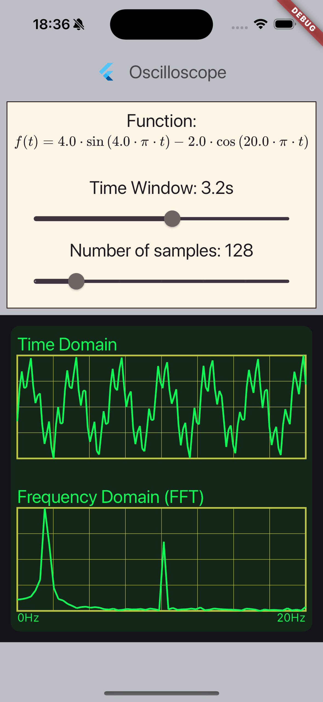

# Flutter Oscilloscope

An example project to experiment with Ticker, a "low level" method for running animations on Flutter.

## Version

This example was created using Flutter `3.22.1`. It has been tested on iOS Simulator iPhone 15 Pro (iOS 17.5).

## Contact

[Linkedin](https://www.linkedin.com/in/sthefanoss/)

PRs are welcome!